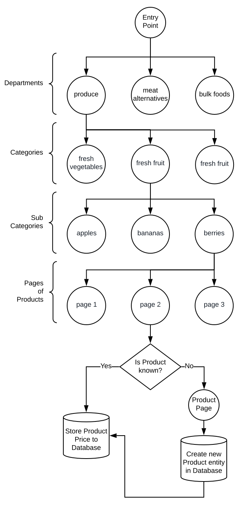

# SaveMore

This is a selenium-based web scraper designed to scrape the online store of Save-On-Foods. Ever wonder what a good price is for a product you don't frequently purchase? That's the driving force behind this project.

Uses Depth First Traversal to get all items listed. If an item isn't previously known (project stores a pkl file of product name dictionary) it scrapes that individual page as well which can add many hours to total traversal time. When SKUs are known the total scraping process can take 3-4 hours, due to very generous/friendly hard-coded wait times.

Currently under development.

```bash
source venv/bin/activate
echo "" > completed_categories.txt
python3 SaveOn.py
```

## Graph showing the Store's Tree Structure


The scraper only receives a list of Departments. It then determines whether it is on a product page or not. It does not know categories or sub-categories. 

If there are subcategories on the page it traverses them depth first.

If there are no subcategories on the page then it retrieves the product pricing.

If we encounter a new product we have to traverse to it's individual page to retrieve all the product's information. This traversal into each product's page would be costly if we had to do it on every product (since there is well over 10k products to scrape). Unfortunately the first time running the scraper this operation is required which results in a one-time slowdown of 20x. 
